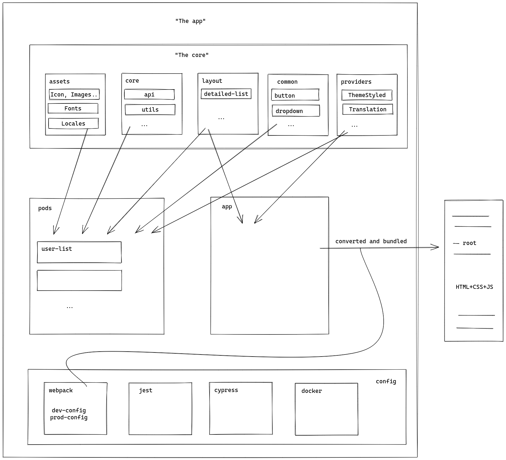
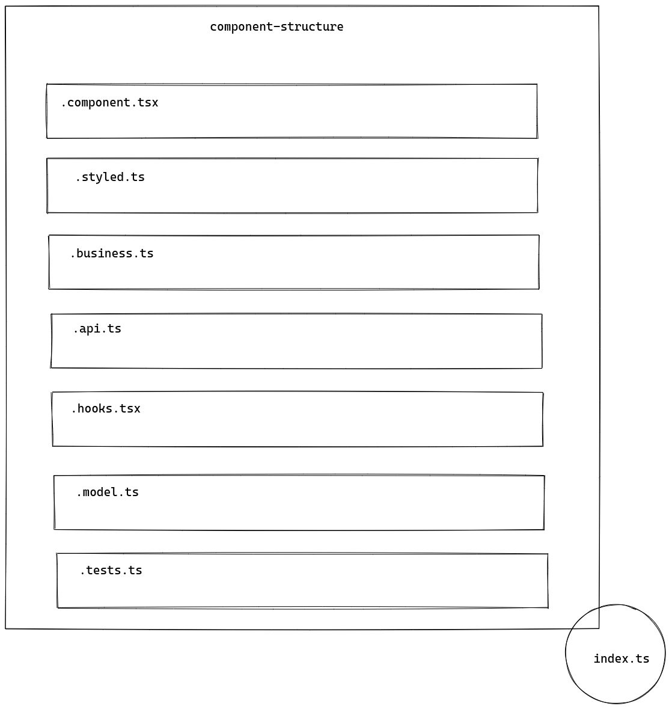
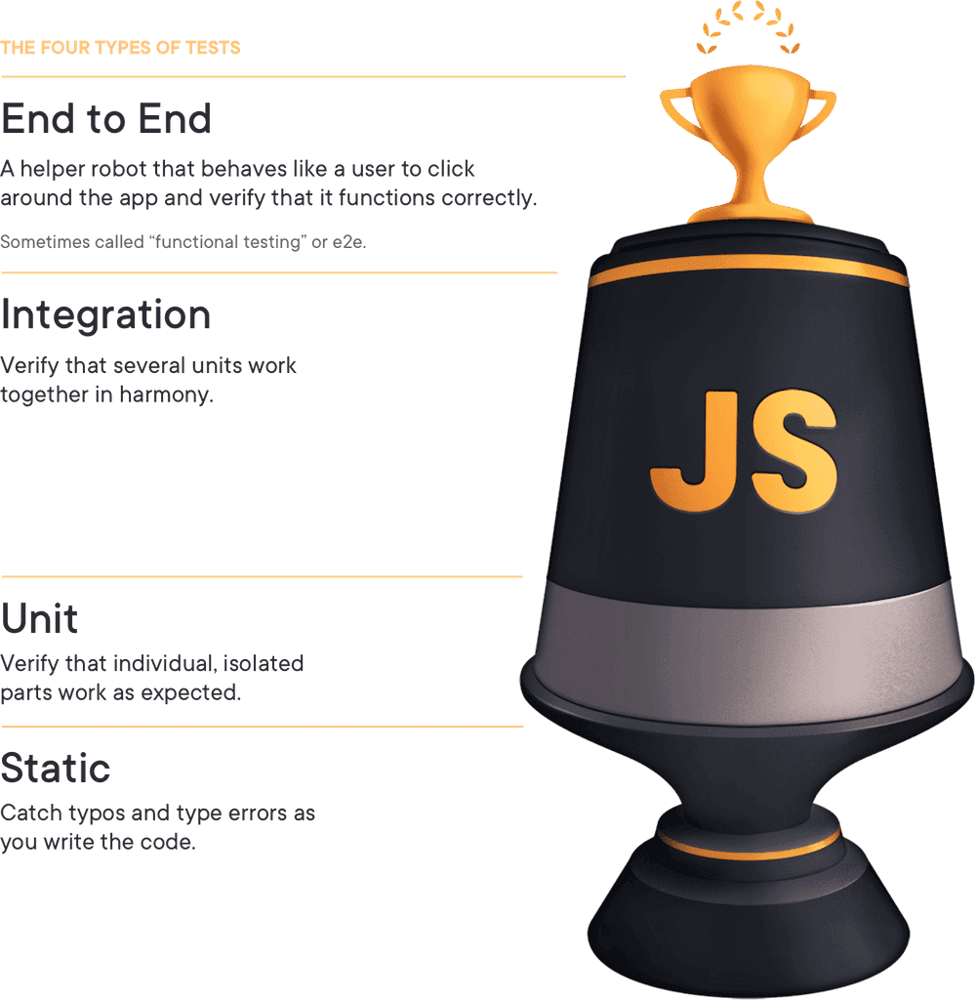

# User List

## Content

_Sampe code_

User list that loads a large number of users using infinite scrolling in a simple way thanks to IntersectionObserver API. Also you can add/update and delete users thanks to the system developed and running under a server that represents a number of users mocked. Developed with Typescript, React & Styled-Components and tested with Jest and React Testing Library

## Getting Started

You'll only have to follow the instructions below to be able to reproduce the project (You can use _npm_ or _yarn_):

1. `yarn install`
2. `yarn start:mock-server`
3. `yarn start`

## Architecture on a high level

Based on Brad Frost's book, "Atomic Design" I have altered some of his ideas to encapsulate the components so that they can be reusable and well organized.
To structure the application we've 3 different parts:

- core
- pods + app
- config

#### CORE

we find everything that we reuse in different components or in the global app, for example:

- **assets** where we find those static files like fonts, icons, etc;
- **core** where we find a customization of the fetch method and some auxiliary functions;
- **layout** to attach all those templates that only give a structural design to the components or the app;
- **providers** where we can find each of the abstractions that contain common data used by different components, to avoid prop-drilling, etc
- **common** that includes all those simple components that make up the functionality of a page or part

#### PODS + APP

In it we'd find if it was a big application a division by functionalities or screens (also classified by navigation). This will form the general app view.

In the app we collected all the pods, providers on a layout to start the app

#### CONFIG

It's about each one of the configurations to package the project, to pass the tests, etc according to the different environments

## Component Structure

We make this division so that we can separate the business logic from the representational layer, as well as split it into more child components if necessary.

In **.business** we leave the whole business layer and operations. In **.hooks** we can generate customized hooks to be able to reuse or lighten the size of the presentational layer.

On the other hand, **.api** where we will transform the data received from backend mapped to use them in the view in question and abstract the intermediate logic that is, we will rely on **.model** to type and streamline the process.

Finally we style the components in **.styled** while we make unitary tests in **.tests**

## Style guide (Theme) (previous development in Figma)

The Figma tool has been used to acquire a homogeneous appearance and a predefined style that could be modified in future versions.

In addition, with Figma it's possible to use StyleDictionary and through the API to obtain style tokens for the different related applications creating a whole Design System that improves communication between UI / UX and developers.

Resources link: [My Figma project](https://www.figma.com/file/FePSOlXe9rx7iAWNyfcfUB/frangaliana-portfolio?node-id=0%3A1)

## Why hasn't the Context API been used?

We'd use the Context API to reuse a common part to different components or keep data constant over time or application flow.

In this case, 2 lists such as the user list and the ordered list aren't used by many components, besides there isn't a great level of nesting to avoid prop-drilling and that these props lose sense. It's necessary to generate a state as we subdivided in components to generate a simple method to work with it and to avoid very nested structures that complicate the understanding or that lead to performance problems.

Option to transform the solution developed in Context API: create a context that keeps both the list and the order lists and by useReducer we'd do the operations of adding, removing and updating on them by actions.

## Why hasn't Immutable.js been used?

In addition to the fact that we don't use Redux, we follow the functional programming principles together with the fact that it isn't a very complex data structure. By this we mean:

- Pure functions, it returns the same result if given the same arguments

- Immutability, a new object is always created when some value is added or altered so we don't find collateral errors

- Functions as first class citizens, mainly because of the approach React takes in addition to the security and structuring it provides.

- Using Higher Order Functions, we leave aside the imperative programming to bet on the declarative one. It gives transparency since in between we don't alter data, but use a function that receives a function as an argument or returns a function as an output.

Besides the use of closures, currying, and so on...

## Why were Jest and React Testing Library chosen as testing tools?

The test base of this project is an example of past experience and research about great developers in React and experts in testing.

**What to try and how to do it?**

We've based ourselves on the scheme that Maggie Appleton created for TestingJavaScript.com that illustrates well the types of tests and why they are important in the testing process:

We've to take into account the following analysis, as described by Kent C. Doods: 2 of the 3 factors that usually measure the use of a particular test type are speed and cost. The higher the "trophy" the slower and more expensive the process will be so we've to choose well in which way to test and this is where the last of the factors, confidence, comes in.

We quote from it:

> _The more your tests resemble the way your software is used, the more confidence they can give you._

Therefore, there is no better way to ensure that the application will work when the user uses it than by doing the same thing the user would do, and this is also the reason why we write tests.

So obviously although the first 2 factors will increase when we go up for the trophy it also increases the latter and that in this test is of particular interest to us. Therefore, we have focused, although in the form of some particular example, on some of the highest and most weighty of the trophy.

This also gives us an advantage and that is that, when testing different components together we won't need to test them all in isolation.

We aren't looking for 100% code coverage. Why? Because as described by Kent C. Dodds in his article [Common Testing Mistakes](https://kentcdodds.com/blog/common-testing-mistakes) code coverage doesn't describe if the code works according to the client's requirements, if it works with other code in the application or if the application could fall into a wrong state.

We also return to the question: **Why do we write a test?**

A logical answer would be to be sure that our application will work when the user uses it, so we should think less about the written code and think more about the use cases. So to solve these problems and be sure we will focus not on code coverage but on use case coverage.

**What advantages do we get from this?**

A test is useless if we try the code because it has to be modified every time it is refactored so we are going to avoid testing based on implementation details.

Also, it will generate more confidence the more the tests are similar to the application.

Using react-testing-library together with jest has been because this library is free of implementation details, so when launching the tests it allows you to focus on the user experience.

## How did we get the features?

To show the list, we've loaded in a mocked api the users file and in it added to each one the age attribute and mainly the id, important for the lists rendering.

For the order of it, we've generated the first list and on it we generate a second one that will be the one that will be in continuous change by the order options since if we want to return to the initial state we simply use the first one of these.(The fields order is character by character with the auxiliary functions created)

Finally, to edit users within the list, thanks to reusing components we've generated a card that depending on the mode will display some action buttons and let you edit. As we don't want to edit any data until the user is sure of it, we save everything in an intermediate object that will finally update the list when the button actions.

## What would be missing to improve or what should be added that has not entered the proposed time?

In addition to the representation of the components to show the expected result and compare it with the obtained one.

- Improved design to increase response quality, as well as use in different browsers

- Code refactoring to encapsulate most common parts and abstract component parts to make them as silly / representative as possible

- Improved packaging with Webpack settings for better performance

- Use of useMemo and useCallback to avoid repeated calls for known parameters

- Remove hardcoded text and use internationalization with reacti18next

- Great extra: add cache, pre-rendering for static parts, give a better user experience and less loading time in successive calls
